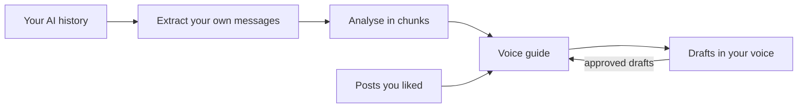

# voice-kit

Write posts and messages that sound like you. A skill for Claude, ChatGPT and Codex.

## The problem

AI drafts sound like AI. Voice prompts and questionnaires don't fix it, because people can't describe their own voice.

But you have already shown it. Every time you told an AI "too long", "that's slop" or "I'd never say that", you wrote down a rule. voice-kit reads those messages and builds your voice guide from them.

## What it does



| Ask | Output |
| --- | --- |
| "Build my voice" | A voice guide: your registers, how your posts sound, your humour, rules you have stated, and tendencies from one-off edits |
| "Write an X post about this" | A draft that keeps your words, cut to half the length, checked against your bans |
| "Message my friend about tonight" | A short message in the way you actually text |
| "Refresh my voice" | The guide updated with what you have written since the last build |

## Install

Claude Code:

```
/plugin marketplace add b1rdmania/voice-kit
/plugin install voice-kit@voice-kit
```

Codex CLI, then install from the plugin browser:

```
codex plugin marketplace add b1rdmania/voice-kit
```

## Sources

| Source | Where it reads |
| --- | --- |
| Claude Code | `~/.claude/projects/` on your machine |
| Codex | `~/.codex/sessions/` on your machine |
| ChatGPT | the `conversations.json` file from a ChatGPT data export |
| Anything else | a text file of your posts or emails, or pasted samples |

## Privacy

**Local extraction and storage.** The extract script runs on your machine and writes to `~/voice/`. Nothing is uploaded by voice-kit itself.

**Best-effort redaction.** Before analysis, the script:

- keeps only your own messages, plus the first 300 characters of the AI reply each one answered
- drops pastes, tool output, and messages that mention health, money, legal or ID matters
- replaces secrets, emails, URLs, handles, phone numbers, card and bank numbers, ID numbers, postcodes, street addresses, IP addresses and usernames in file paths with labels such as `[email]`
- replaces capitalised names of people, places and companies with `[name]`

This is pattern matching, not a guarantee. Names written in lowercase, and sensitive subjects that avoid the keywords, can get through. Look at `~/voice/corpus.jsonl` before a build if your history holds anything you would not want an AI provider to read.

**Analysis by your AI provider.** The cleaned corpus is read by the AI host you run voice-kit in (Claude, ChatGPT or Codex), under that provider's terms. Never commit `~/voice/`.

## Works with plain-english

If the [plain-english](https://github.com/b1rdmania/claude-plain-english-skill) skill is installed, voice-kit runs its full audit on every post, and your voice guide decides which flags to keep. Without it, voice-kit uses a short built-in list.

## Requirements

`python3` for the extract scripts. Without it, paste 30 to 50 samples of your writing instead.

## Example

`examples/guide-example.md` is a filled guide for a made-up person.

## Licence

MIT
