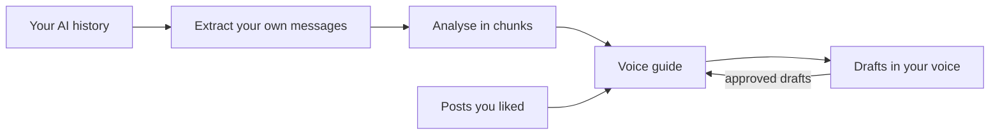

# Voice Kit

**Human-led writing, your voice.**

You bring the ideas. Voice Kit helps you put them into words that sound like you.

Build a reusable voice guide from your own writing and the feedback you have given AI. Draft posts, emails and messages with plain-English editing that respects your style. Your preferences lead; you choose the final words.

A writing skill for ChatGPT, Codex and Claude.

## It learns from your corrections

“Too long.” “Less formal.” “I would never say that.” Your corrections show how you want to write. Voice Kit uses them alongside your writing samples to build a guide you can read, edit and reuse.

## What it does



| Ask | Output |
| --- | --- |
| "Build my voice" | A voice guide: your registers, how your posts sound, your humour, rules you have stated, and tendencies from one-off edits |
| "Write an X post about this" | A draft that keeps your words, matched to your preferred length, checked against your bans |
| "Message my friend about tonight" | A short message in the way you actually text |
| "Refresh my voice" | The guide updated with what you have written since the last build |

## Install

Claude Code:

```
/plugin marketplace add b1rdmania/voice-kit
/plugin install voice-kit@voice-kit
```

Codex CLI, then install from the plugin browser:

```
codex plugin marketplace add b1rdmania/voice-kit
```

## ChatGPT and web use

Supply a ChatGPT export, pasted writing samples, or an existing voice guide. The plugin cannot automatically access your past chats or files on your computer. With file tools, it returns a downloadable `guide.md`; otherwise it gives you copyable Markdown. Save the guide and provide it in later chats, with any approved drafts you want it to use. Hosted session storage may not persist.

For local Codex or Claude Code use, the chosen history is extracted on your machine and the guide defaults to `~/voice/`.

## Sources

| Source | Where it reads |
| --- | --- |
| Claude Code | `~/.claude/projects/` on your machine |
| Codex | `~/.codex/sessions/` on your machine |
| ChatGPT | the `conversations.json` file from a ChatGPT data export |
| Anything else | a text file of your posts or emails, or pasted samples |

## Privacy

Read the [Voice Kit privacy policy](https://gist.github.com/b1rdmania/8b4e9569e08e7c3b23e8e4f9a7ee53bc).

**Storage depends on the host.** Local execution writes to `~/voice/`. Web use processes files you upload in the host’s session storage. Uploading an export already shares it with that provider before redaction. The scripts do not send files to any service.

**Best-effort redaction.** Before analysis, the script:

- keeps only your own messages, plus the first 300 characters of the AI reply each one answered
- drops pastes, tool output, and messages that mention health, money, legal or ID matters
- replaces secrets, emails, URLs, handles, phone numbers, card and bank numbers, ID numbers, postcodes, street addresses, IP addresses and usernames in file paths with labels such as `[email]`
- replaces capitalised names of people, places and companies with `[name]`

This is pattern matching, not a guarantee. Names written in lowercase, and sensitive subjects that avoid the keywords, can get through. Look at `~/voice/corpus.jsonl` before a build if your history holds anything you would not want an AI provider to read.

**Analysis by your AI provider.** The cleaned corpus is read by the AI host you run voice-kit in (Claude, ChatGPT or Codex), under that provider's terms. Never commit `~/voice/`.

## Works with plain-english

If the [plain-english](https://github.com/b1rdmania/claude-plain-english-skill) skill is installed, voice-kit runs its full audit on every post, and your voice guide decides which flags to keep. Without it, voice-kit uses a short built-in list.

## Requirements

`python3` for the extract scripts. Without it, paste 30 to 50 samples of your writing instead.

## Example

`examples/guide-example.md` is a filled guide for a made-up person.

## Licence

MIT

## Build a submission ZIP

Run `python3 scripts/build_plugin.py`. The allowlisted archive contains the plugin, bundled skill, icon and public documentation. It excludes Git history, local data and build tooling.
